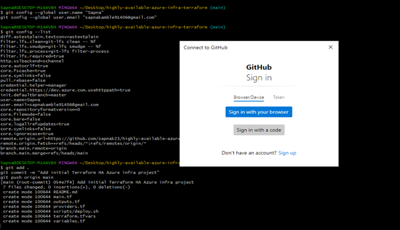
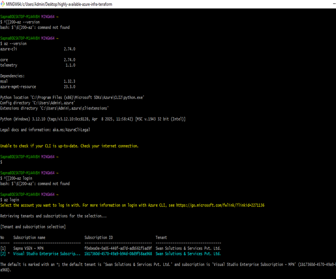
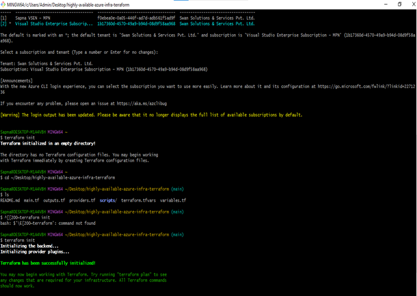

## 📸 Setup & Initialization Screenshots

These screenshots show the initial setup steps before deploying infrastructure using Terraform.

### 🔗 Git Connected to GitHub
This shows that Git is configured with your identity and your local repository is connected to GitHub.

---

### ☁️ Azure CLI Installed and Logged In
This screenshot shows the successful installation of Azure CLI and login using the `az login` command.

---

### 🚀 Terraform Initialized
After creating your `.tf` files, you run `terraform init` to initialize the Terraform project.

